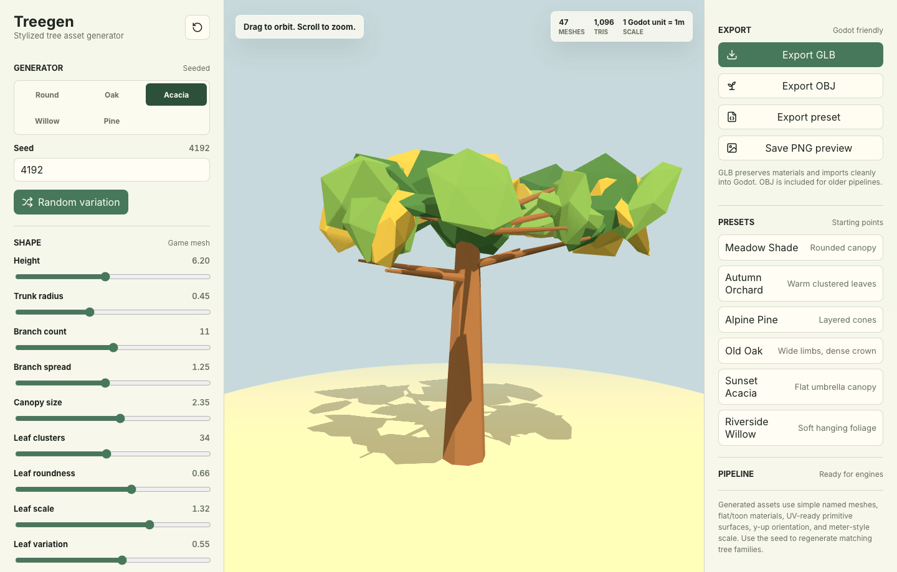

# treegen

Stylized low-poly tree generator. Deterministic — the same seed always produces
the same tree — and game-ready: exports GLB or OBJ with sane triangle counts.



Three ways to use it:

| Surface | Entry point |
|---|---|
| Browser app | `npm run dev` |
| MCP server (stdio) | `npm run mcp` |
| Library | `import { buildTree } from 'treegen/generator'` |

It is also hosted as a remote MCP server at
`https://mcp.andreglegg.no/treegen`, so no install is needed:

    claude mcp add --transport http treegen https://mcp.andreglegg.no/treegen

## Library use

The generator is DOM-free and runs in Node or the browser. Only `three` is a
runtime dependency — everything else here is dev-only.

    npm install github:andreglegg/treegen

```js
import { buildTree, meshStats, presets } from 'treegen/generator';
import { exportGlb } from 'treegen/export';

const tree = buildTree({ ...presets.oak, seed: 42, detail: 1 });
console.log(meshStats(tree));        // { meshes, triangles }
const glb = await exportGlb(tree);   // ArrayBuffer — works in Node and browser
```

`exportGlb` shims `FileReader` when it is missing, so the same code path works
in Node and in the browser.

## Parameters

Six presets (`meadow`, `orchard`, `pine`, `oak`, `acacia`, `willow`) and five
species silhouettes (`round`, `oak`, `acacia`, `willow`, `pine`). Everything is
bounded — see `paramShape` in `mcp/server.js` for ranges.

`detail` drives the triangle budget:

| detail | triangles | intent |
|---|---|---|
| 0 | ~1k | low-poly |
| 1 | ~3k | game-ready |
| 2 | ~7k | hero |

## Consumers

`mcp/generator.js` and `mcp/export.js` are the shared core. Anything that
depends on them should pull this repo as a git dependency rather than copying
the files — the copies drift.
